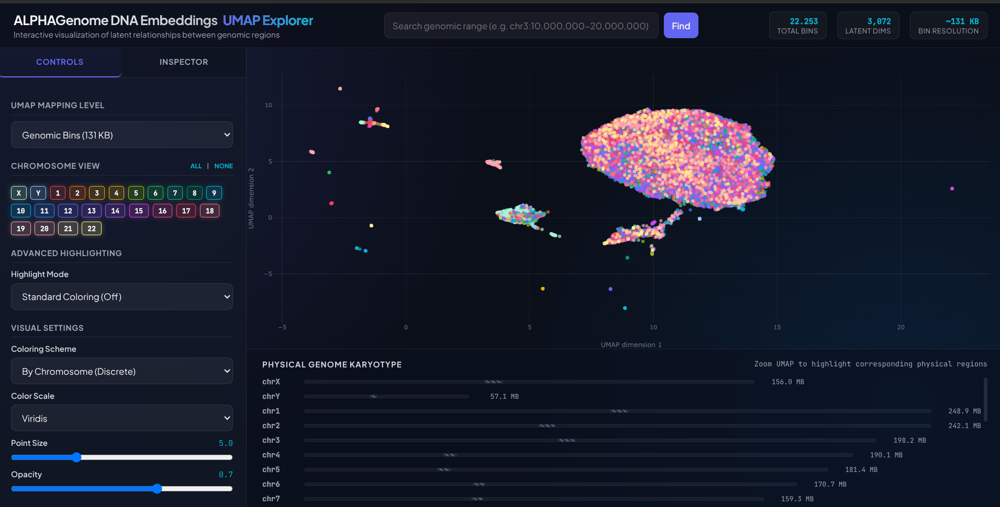

# ALPHAGenome DNA Embeddings — UMAP Explorer

[](https://lagosproject.github.io/DNAEmbeddings/)

An interactive visualization of latent relationships between genomic regions, built from **ALPHAGenome** DNA foundation model embeddings.

<p align="center">
  
</p>

---

## 🌐 Live Demo

**→ [Open the UMAP Explorer](https://lagosproject.github.io/DNAEmbeddings/)**

The web app runs entirely in the browser — no server needed. All pre-computed UMAP coordinates and gene/pathway annotations are bundled as static JSON files.

---

## 🧬 What This Visualizes

The human genome (hg38 / GRCh38) is divided into **~12,400 non-overlapping 131 KB bins**. Each bin's DNA sequence is embedded into a 3,072-dimensional latent space using the ALPHAGenome foundation model. These high-dimensional embeddings are then projected into 2D using UMAP, revealing:

- **Chromatin structure clusters** — Regions with similar regulatory profiles cluster together
- **Gene-level patterns** — Averaged bin embeddings per gene, projected to a Gene UMAP
- **Pathway-level patterns** — Averaged gene embeddings per KEGG/Reactome pathway

### Three Mapping Levels

| Level | Points | Description |
|-------|--------|-------------|
| **Genomic Bins** | ~12,400 | Raw 131 KB windows, colored by chromosome or position |
| **Individual Genes** | ~25,000 | Average embedding per RefSeq gene |
| **Biological Pathways** | ~1,200 | Average embedding per KEGG/Reactome pathway |

---

## 📂 Repository Structure

```
DNAEmbeddings/
├── index.html                        # Main web application (single-file, self-contained)
├── res/                              # Pre-computed data (JSON files tracked in git)
│   ├── umap_results.json             # Bin-level UMAP coordinates (global + per-chromosome)
│   ├── gene_umap_results.json        # Gene-level UMAP coordinates
│   ├── pathway_umap_results.json     # Pathway-level UMAP coordinates
│   └── gene_annotations.json         # Gene/pathway annotations (RefSeq + MyGene.info)
├── scripts/                          # Pipeline and utility scripts
│   ├── run_umap.py                   # Compute UMAP from raw embeddings
│   ├── run_umap_extensions.py        # Compute gene & pathway UMAP projections
│   ├── download_annotations.py       # Download gene/pathway annotations
│   ├── serve.py                      # Local development server
│   └── rethrow.sh                    # Re-run full pipeline
└── docs/                             # Documentation assets
```

### Files NOT in this repo (too large for GitHub)

The following files are generated locally and excluded via `.gitignore`:

| File pattern | Size | Purpose |
|---|---|---|
| `res/chr*_embeddings.npy` | ~250 MB total | Raw 3,072-dim ALPHAGenome embeddings per chromosome |
| `res/chr*_metadata.csv` | ~0.5 MB total | Bin coordinate metadata (chrom, start, end) |
| `res/refGene.txt.gz` | ~8 MB | UCSC RefSeq gene database cache |

These are only needed to **re-run** the UMAP computation pipeline. The web app works without them.

---

## 🚀 Deployment on GitHub Pages

This repository is configured to be deployed directly via **GitHub Pages** from the root (`/`) of the `main` branch.

### Setup Steps

1. **Push to GitHub:**
   ```bash
   git remote add origin https://github.com/lagosproject/DNAEmbeddings.git
   git push -u origin main
   ```

2. **Enable GitHub Pages:**
   - Go to **Settings → Pages** in your repository
   - Under *Source*, select **Deploy from a branch**
   - Choose `main` branch and `/` (root) directory
   - Click **Save**

3. **Access your site:**
   ```
   https://lagosproject.github.io/DNAEmbeddings/
   ```

---

## 🛠️ Local Development

### Quick Start (just the viewer)

```bash
python3 scripts/serve.py
```

This opens the interactive explorer at `http://localhost:8000/index.html`.

### Full Pipeline (re-generate everything from embeddings)

If you have the raw `.npy` embedding files:

```bash
# 1. Run UMAP dimensionality reduction
python3 scripts/run_umap.py

# 2. Download gene/pathway annotations
python3 scripts/download_annotations.py

# 3. Compute gene & pathway UMAP projections
python3 scripts/run_umap_extensions.py

# 4. Launch the web viewer
python3 scripts/serve.py

# Or run the full pipeline at once:
bash scripts/rethrow.sh
```

#### Python dependencies:
```
numpy
pandas
umap-learn
requests
```

---

## 🎨 Features

- **Interactive UMAP Scatter Plot** — Powered by Plotly.js with zoom, pan, hover inspection
- **Three Mapping Levels** — Toggle between genomic bins, genes, and biological pathways
- **Chromosome Selection** — View all chromosomes or isolate specific ones (single-click toggle, double-click solo)
- **Advanced Highlighting** — Search and highlight by gene symbol, biological pathway, or unannotated "desert" regions
- **Inspector Panel** — Click any point to see coordinates, overlapping genes, functional summaries, and KEGG/Reactome pathways
- **Physical Karyotype** — Bottom panel shows physical genome positions of visible UMAP points
- **Genomic Search** — Search by coordinate range (e.g. `chr3:10,000,000-20,000,000`), gene symbol, or pathway name
- **Fully Offline** — All data is pre-bundled; works without any API calls

---

## 📊 Data Sources

| Source | Usage |
|--------|-------|
| **ALPHAGenome** | DNA sequence embeddings (3,072-dim per 131 KB bin) |
| **UCSC RefSeq** (hg38) | Gene coordinate annotations |
| **MyGene.info** | Gene functional summaries, KEGG & Reactome pathway mappings |
| **UMAP** | Dimensionality reduction (cosine metric, n_neighbors=15, min_dist=0.1) |

---

## 📜 License

This project is provided for research and educational purposes.

---

## 🙏 Acknowledgments

Built with [Plotly.js](https://plotly.com/javascript/), [UMAP](https://umap-learn.readthedocs.io/), and genomic data from [UCSC Genome Browser](https://genome.ucsc.edu/) and [MyGene.info](https://mygene.info/).
